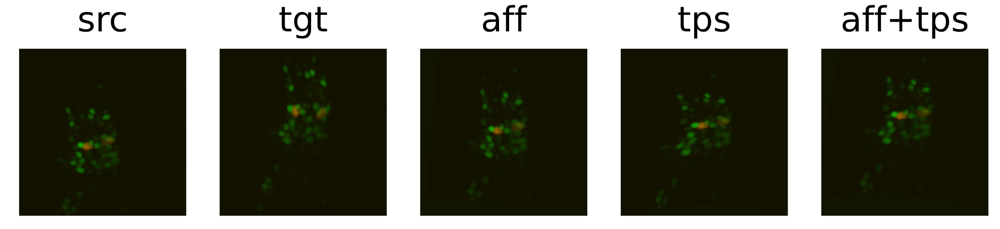

# Deep learning techniques for geometric matching of *C. elegans* brain microscopy images


Based on the [source code](https://github.com/ignacio-rocco/cnngeometric_pytorch), from Rocco et al.'s [2017 paper](https://arxiv.org/abs/1703.05593)
**Authors:**

- Richie Yat-tsai Wan
- Pedro Bedmar-López
- Kevin Qiu

## Getting started

The following libraries are must be installed:

```
cv2
imgaug
numpy
glob
PIL
h5py
imageio
torch
skimage
torchvision
matplotlib
tqdm
natsort
six
```
Tip: It's highly recommended to have CUDA available as many tasks here could take very long without the use of a GPU.

## Running the program

To run `run.py`, check the options and docstring.
Example of run :
```
python -W ignore run.py --datapath '../worm_data/video/frames/' --datatype image --alignment-target '../worm_data/video/frames/frame_508.jpg'
```
or
```
python -W ignore run.py --datapath '../worm_data/video/' --datatype video --extension avi --alignment-target frame_500
```

By default, is uses our best custom architecture for Feature Extraction and Feature Regression.

If datatype video or h5 is specified, it will first extract the frames from the files and then align the frames to either a specified target.

For those h5 or video, please specify the target as frame_number,
ex : If you know the frame number, specify 'frame_162' as target.

When using a video, give an estimate frame number based on video FPS and duration.

------------------

To run `demo.ipynb`, download the base weights and extract them under `./trained_models/base_weights/`

[base_Affine Weights](http://www.di.ens.fr/willow/research/cnngeometric/trained_models/pytorch/best_streetview_checkpoint_adam_affine_grid_loss_PAMI.pth.tar)

[base_TPS Weights](http://www.di.ens.fr/willow/research/cnngeometric/trained_models/pytorch/best_streetview_checkpoint_adam_tps_grid_loss_PAMI.pth.tar)

Weights for Resnet101 are too large to fit on Github. You can download them [here](https://drive.google.com/file/d/1KN13tTdfkbroPnjwoFOK1lnL9X4wY9AT/view?usp=sharing) instead.

To get the useable .h5 data, download it [here](https://drive.google.com/file/d/13EA_BLrneB1tDyk0leslCsU6eZagJH1D/view?usp=sharing) and save it as `more_data.h5` under `./worm_data/h5_data/`

To get the old .h5 data, download it [here](https://drive.google.com/file/d/15yliIRD1o6EifZ4v4zn-Zklfw_NIlEpL/view?usp=sharing) and save it as `epfl3.h5` under `./worm_data/h5_data/`

For the video, download it [here](https://drive.google.com/file/d/1AFeFE7KMB8yIGI9T-sdZ7pZS9bMoZ0ln) and save it as `
20200624_142043_crop_0_2_4.avi` under `./worm_data/video/`

## Folder structure
```
├── project2
    ├── code
    |   |── `data/` : scripts to download the datasets used by Rocco et al.
    |   |── `datasets/` : contains the training/validation datasets
    |   |── `draft_notebooks/` : notebooks used during exploration
    |   |── `functions/` : contains all functions used by the scripts (helpers, loading models, aligning, data augmentation, etc.)
    |   |── `geotnf/` : methods for applying geometric transformations
    |   |── `losses/` : files pertaining to loss graphs
    |   |── `image/` : methods for image handling such as normalization
    |   |── `model/` : .py files for model creation.
    |   |── `options/` : options for the various .py scripts.
    |   |── `trained_models/` : trained weights saved under here
    |   |── `training_data/` : paths to the images used to train the model saved under here as csv files.
    |   └── `util/` : various utility methods.
    |  *notebooks are to be ran in the following order.*
    |   |── `0_data_extraction.ipynb`
    |   |── `1_data_generation.ipynb`
    |   |── `2_apply_model.ipynb`
    |   |── `demo.ipynb`
    |   |── `demo_worm_brains.ipynb`
    |   |── `eval.py` : evaluates a trained model (Untouched from Rocco et al.'s repo)
    |   |── `generate_trainval.py` : generates the training data (with or without augmentation) as well as CSV files used to split the datasets
    |   |── `train.py` : trains the network
    |   └── `run.py`
    └── worm_data
        |── `h5_data/` : contains the .h5 files and all associated files created from it.
        └── `video/` : contains the .avi video and all associated files created from it.

```
For more information, see comments inside each file.
All the files that aren't described above will be explained in the sections below more deeply.

## run.py description

Script written to show a summary of our work. It can be executed on terminal with ```python -W ignore run.py``` and can be customized with the options described in ```python -W ignore run.py -h```:

```
usage: run.py [-h] [--datapath DATAPATH] [--datatype DATATYPE] [--extension EXTENSION]
              [--alignment-target ALIGNMENT_TARGET] [--h5-channels H5_CHANNELS]
              [--aff-model AFF_MODEL] [--aff-fr AFF_FR] [--aff-weight AFF_WEIGHT]
              [--tps-model TPS_MODEL] [--tps-fr TPS_FR] [--tps-weight TPS_WEIGHT]
```

Firstly it loads the desired weights over the desired architecture (by default the best we have).

Depending on the file ```--datatype``` we choose it will extract the data to align directly from images, or from videos or h5 files:
- If ```video``` option is selected, it will first extract all his frames. These will be the images to align.
- If ```h5``` is selected, it will first transform the file into images. Tuning ```--h5-channels``` it's possible to choose between extracting ```red```, ```green``` or ```rgb``` channels. In the rgb case, the blue channel is filled as empty, as the original h5 file we created training data from doesn't contain it.

Another option of run.py is ```--alignment-target```. It represents the exact filename (with relative path) of the alignment target, or a frame number if it is a h5 file. 

Ex : "../folder/frames/frame_123.jpg". By default, or if no target has been specified, it will align to the previous frame. If the filetype is .h5 or video, it will align to the previous frame, unless a target has been specified. for h5 or video must be specified as "frame_number", ex : "frame_123".

```--datapath DATAPATH``` stores the path to the folder containing the data to align.

Once all these parameters have been loaded, the function ```batch_align()``` is called and a video is saved as result containing the aligned images, as well as the raw aligned images.


## Main notebooks description
### 0_data_extraction.ipynb
In this file we extract the data that we will use for training and testing our model transforming it on images. The data will come in two formats, so we find two sections:

###### a) Handling video files: ```extract_frames_video()```
It saves the frames of the ```.mp4``` video stored in ```worm_data/video/``` as ```.jpg``` images.

###### b) Handling h5 files: ```extract_frames_h5()```
It extracts the frames of the .h5 files stored in ```worm_data/h5_data/``` as ```.jpg``` images. As we work with two files (```epfl3.h5``` and ```more_data.h5```) we end up with two subfolders (```worm_data/h5_data/240``` and ```worm_data/h5_data/512```). Inside every folder we save the ```.jpg``` images as ```rgb_frames```, ```red_frames``` or ```green_frames``` .


### 1_data_extraction.ipynb
This file processes the raw images generated in the previous step before feeding them into the model.

###### a) Data augmentation: ```augment_images()```
The number of available images to train the model is increased by applying some transformations to the original ones as:
- Shearing
- Rotation
- Scale changing
- Gaussian noise addition

The transformed images are saved into ```<input_path>/augmented/```. Those transformations are applied randomly, so if we set ```times_target>1```, thanks to ```iaa.SomeOf()``` we will get different results on each iteration. For our purpose we set ```times_target=10```, multiplying by 10 the number of data.

###### b) Train/validation sets generation: ```create_csv_split()```
For each given training dataset stored manually in ```code/datasets/<name_of_dataset>/TrainVal```, this function generates three ```.csv``` files in ```code/training_data/<name_of_dataset>-random/TrainVal```, containing the path of every image on the dataset:
- ```data.csv``` -> Paths of all the images
- ```train.csv``` -> Paths of the images used for training the model
- ```val.csv``` -> Paths of the images used for validation

The train/val split is done randomly.

### 2_model.ipynb
###### a) Training:
Training configuration options are printed. We provide some pre-trained weights, so it's not necessary to train the model again for this notebook.

###### b) Applying the model and loading weights: ```load_model()```
The model is built using the specified architecture indicated in the parameters, and the specified weights are loaded in this architecture.
The architecture and weights we use as example are the best ones we have achieved, being the feature extractor ```wormbrain_1``` and the feature regressor ```simpler```

###### c) Image warping: ```save_warped()``` and ```preprocess_image()```
A source image is aligned with respect to a target image.

###### d) Batch alignment: ```batch_align_to_previous()``` and ```save_video()```
Given a folder of images we align each frame to the previous one. The resulting set of images is saved as a video. Given the frames of the one stored in ```worm_data/video/```, we get to stabilize it.

### demo.ipynb
Rocco's results demo. Given a source and a target image, it transforms the source to match the target. For this demo, the pre-trained weights have been generated by training a vgg architecture on the street view dataset.

From left to right: Source image ```src```, target image ```tgt```, affine transformation of source image ```aff```, thin plane spline transformation ```tps``` and the combination of both ```aff+tps```


### demo_worm_brains.ipynb
Last demo used pre-trained weights and architecture provided by Rocco. This demo shows the performance of our best architecture and weights over a pair of worm brain images.




### draft_notebooks/w_architecture_exploration.ipynb
Printing of the different CNN architectures we have implemented and tested. The model combines three phases: ```FeatureExtraction``` (VGG), ```FeatureCorrelation``` and ```FeatureRegression```. For each stage exists a different architecture.

Firstly, the preset network architecture is printed. The input/output dimensions between stages are also printed.

After that we show the ```FeatureExtraction``` architectures developed by Pedro and Richie.

Finally we show the ```FeatureRegression``` architecture we have developed. Firstly we made a complex feature regressor, but we simplified it
to improve loss. Both are shown.

For developing all this we have taken into account the size of the inputs and outputs, to make them coincide with the ones in the preset model.
